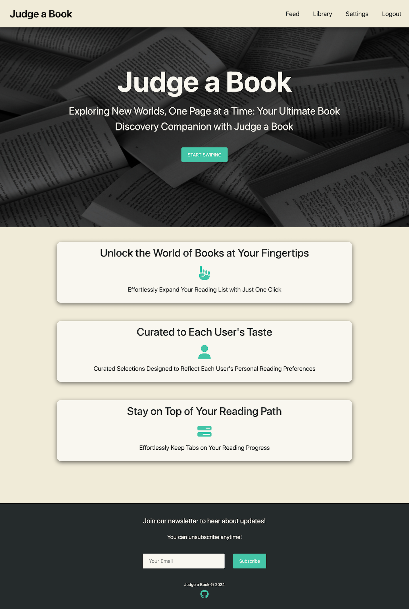
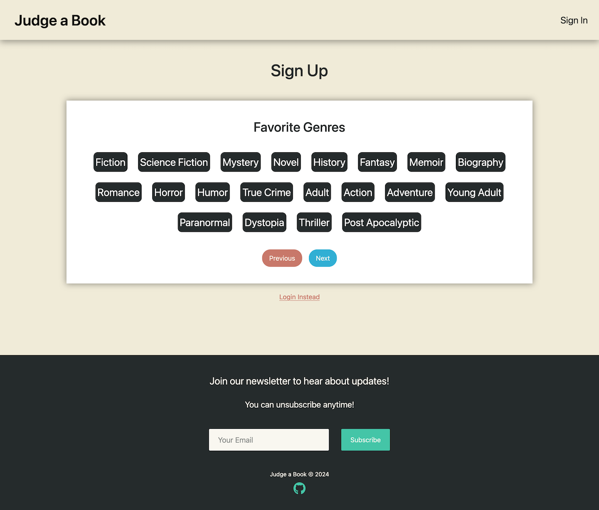
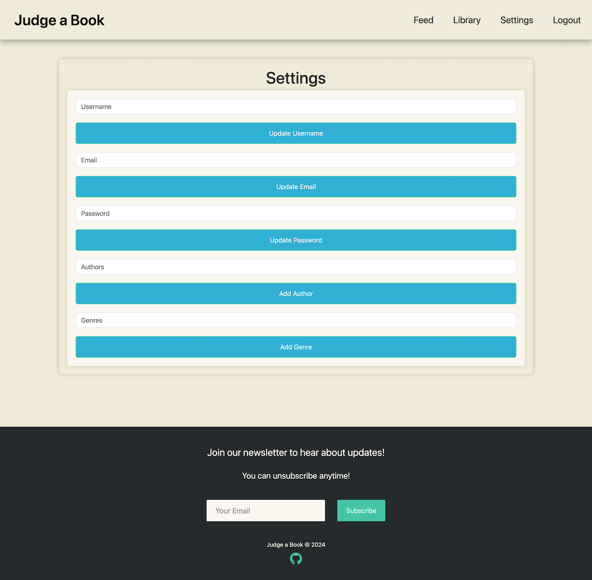
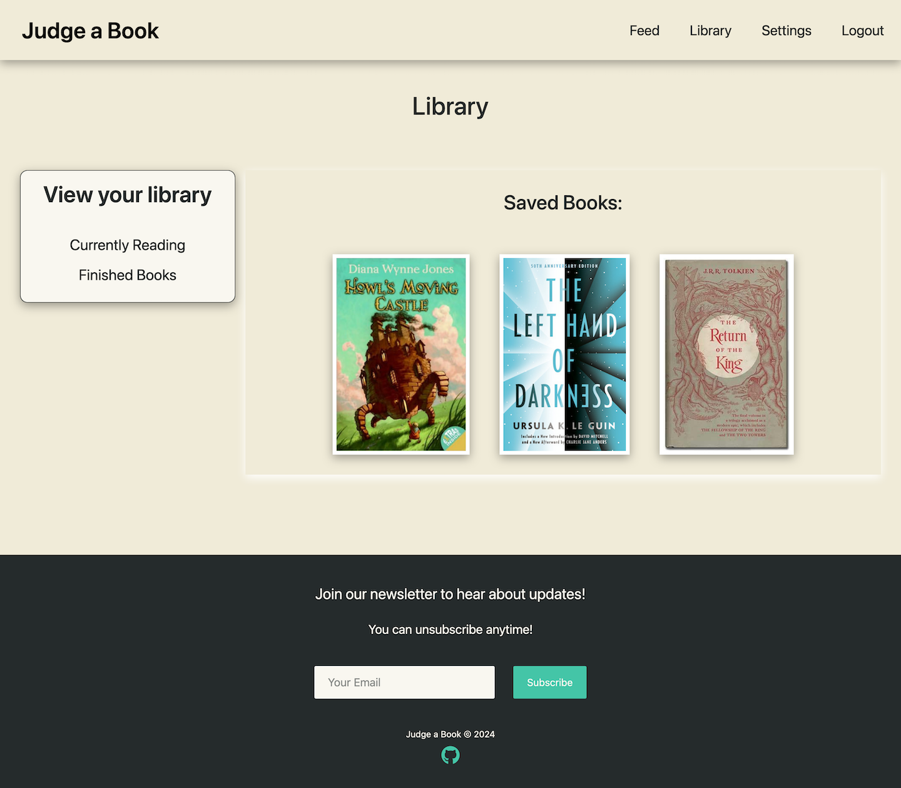
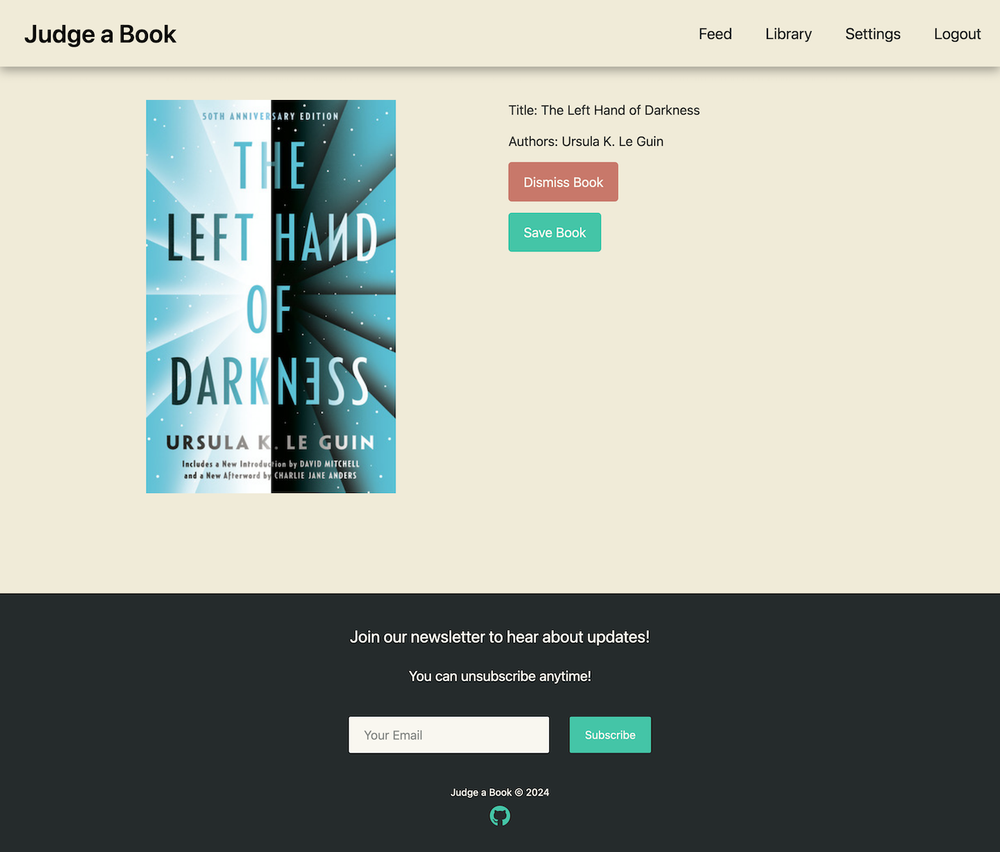

# Judge a Book

## Description

Judge a Book is a book recommendation and tracking app. It helps users find new books that appeal to them and helps them keep track of what they want to read, what they're currently reading, and what they've already read.

## Features

* Book recommendation
    * View a feed of recommended books
    * Dismiss the book or save it for later
* Library
    * View saved books, currently reading books, and finished books
    * Manage catagory for each book
* User accounts
    * Sign up/log in
    * Change email, username, and password
    * Add additional book preferences

## Technologies Used

* HTML, CSS, JavaScript (basic web technologies)
* Bootstrap (CSS framework)
* Node.js (Backend JavaScript platform)
* Express.js (Web server)
* React (Front-end library)
* Mongo (NoSQL database)
* Mongoose (ODM)
* GraphQL (API query language)

## Installation

There is no installation needed to use the app. Simply visit the deployed app at https://judge-a-book.onrender.com/, or visit a local deployment if you have one.

To deploy locally/install the server, clone the project's GitHub repository to your machine, navigate to the project directory, and run `npm i` in your terminal. Once the packages install, run `npm run seed` to seed the project database, and `npm start` to start the server. Once the server is running, it will print the port it is listening on in the command line. You can navigate to `http://localhost/[PORT]` in your web browser to connect to your local server.

## Usage

Visit the homepage to see general information about the app:

Visit the login and signup pages by clicking on the button on the homepage, or by visiting the sign in tab in the navbar. Use the signup page to sign up for an account, and the login page to log in to your account. When signing up for an account, you will be prompted to answer questions about your reading preferences:

Visit the settings page to change your username, email, or password, or to manage your preferences:

Visit the library page to view information about your books:

Visit the feed page to view your recommended books:

## Credits

The contributors to this project are: Joel Teleha ([GitHub](https://github.com/jteleha)), Noah Fryman ([GitHub](https://github.com/noah-10)), and Spencer Surface ([GitHub](https://github.com/SpencerSurface)).

Initial work on the server, database, and API was done together. Other work was done 

Joel worked on the home and settings pages.

Noah worked on the library and sign in pages.

Spencer worked on the feed page.

All code was written by ourselves unless otherwise noted. A number of files were patterned in whole or in part on files provided by edX Boot Camps LLC. Notably `server/server.js` and especially `server/config/connection.js` have been modified very little due to their boilerplate nature.

The image `client/assets/background.jpg` is by [Gülfer ERGİN](https://unsplash.com/@gulfergin_01) on [Unsplash](https://unsplash.com/photos/white-and-brown-book-on-brown-woven-surface-LUGuCtvlk1Q).
